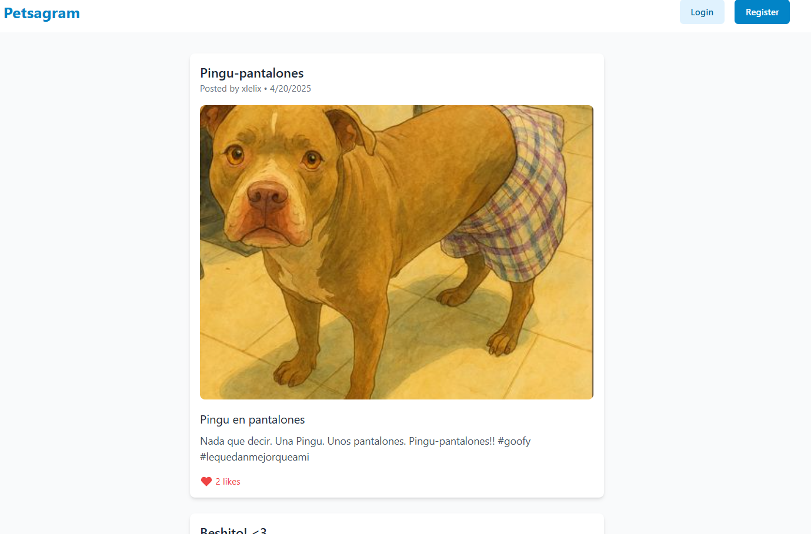
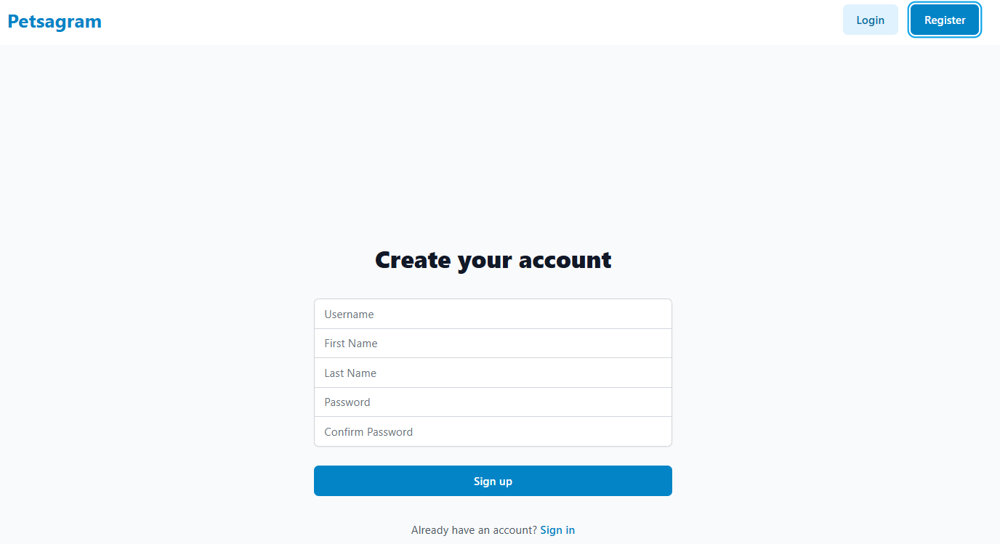
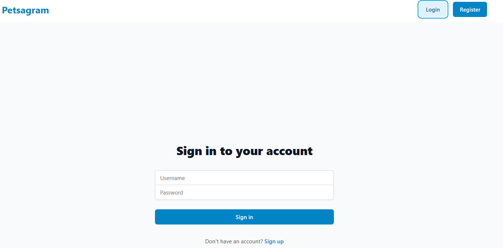
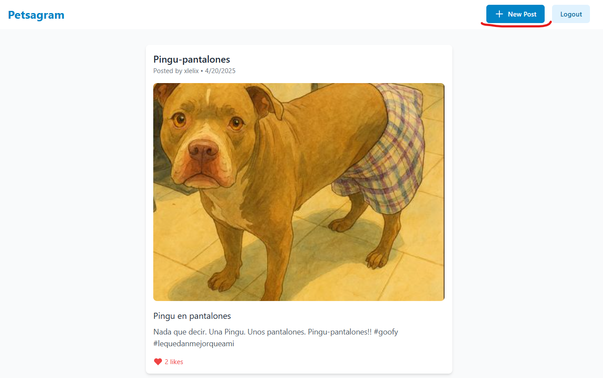
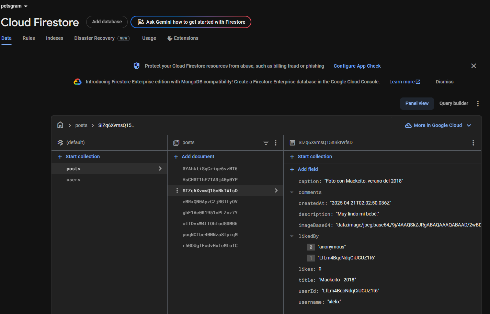

# 🐾 Petstagram - Red Social para Mascotas

## 📱 Descripción
Petstagram es una red social moderna inspirada en Instagram, diseñada específicamente para amantes de las mascotas. Permite a los usuarios compartir fotos de sus mascotas, interactuar con otros dueños de mascotas y crear una comunidad vibrante de amantes de los animales.

✨ Características Principales:
- ✅ **Autenticación de Usuarios** – Registro y login de usuarios
- ✅ **Publicación de Fotos** – Comparte fotos de tus mascotas con descripción
- ✅ **Sistema de Likes** – Interactúa con las publicaciones de otros usuarios
- ✅ **Diseño Responsivo** – Interfaz adaptable a cualquier dispositivo
- ✅ **Compresión de Imágenes** – Optimización automática de imágenes
- ✅ **Interfaz Intuitiva** – Diseño moderno y fácil de usar

---

## 👤 Información del Proyecto
- **Desarrolladora:** Lesley Peguero
- **Matrícula:** 2023-1591
- **Asignatura:** Programación Web
- **Profesor:** Raydelto Hernández
- **Institución:** ITLA (Instituto Tecnológico de Las Américas)

## 🛠️ Tecnologías Utilizadas

- 
- 
- 
- 

## 🚀 Características Técnicas

### Frontend
- Construido con React y Vite para un rendimiento óptimo
- Estilizado con TailwindCSS para un diseño moderno y responsivo
- Manejo de estado eficiente con React Hooks
- Optimización de imágenes para mejor rendimiento

### Backend (Firebase)
- Autenticación de usuarios
- Base de datos Firestore para almacenamiento de datos
- Almacenamiento de imágenes optimizado
- Reglas de seguridad personalizadas

## 📱 Funcionalidades Principales

1. **Autenticación**
   - Registro de usuarios
   - Inicio de sesión
   - Cierre de sesión

2. **Publicaciones**
   - Crear nuevas publicaciones con imágenes
   - Añadir títulos y descripciones
   - Compresión automática de imágenes
   - Visualización en formato feed

3. **Interacción Social**
   - Sistema de likes en publicaciones
   - Contador de likes en tiempo real
   - Interfaz intuitiva para interacciones

## 🚀 Instalación y Uso

1. Clonar el repositorio:
```bash
git clone [URL_DEL_REPOSITORIO]
```

2. Instalar dependencias:
```bash
npm install
```

3. Configurar variables de entorno:
```bash
cp .env.example .env
# Configurar las variables de Firebase
```

4. Iniciar el servidor de desarrollo:
```bash
npm run dev
```

## 📸 Capturas de Pantalla

### 🏠 Página Principal

Vista principal de Petstagram donde se muestran todas las publicaciones de mascotas en un feed estilo Instagram.

### 👤 Autenticación
#### Registro

Página de registro con campos para nombre, apellido, usuario y contraseña.

#### Inicio de Sesión

Interfaz de inicio de sesión simple y segura.

### 📝 Creación de Posts

Interfaz para crear nuevas publicaciones con:
- Carga de imágenes con vista previa
- Campo para título
- Campo para descripción
- Compresión automática de imágenes

### ❤️ Interacción Social

Cada publicación muestra:
- Imagen de la mascota
- Título y descripción
- Contador de likes
- Botón de like interactivo
- Información del autor


## 🔒 Configuración de Firebase

El proyecto utiliza los siguientes servicios de Firebase:
- Authentication para gestión de usuarios
- Firestore Database para almacenamiento de datos
- Storage para almacenamiento de imágenes


## 📝 Licencia

Este proyecto está bajo la Licencia MIT - ver el archivo [LICENSE.md](LICENSE.md) para más detalles.

---

Desarrollado con ❤️ por Lesley Peguero 
